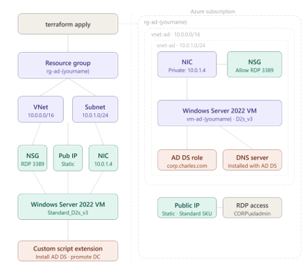
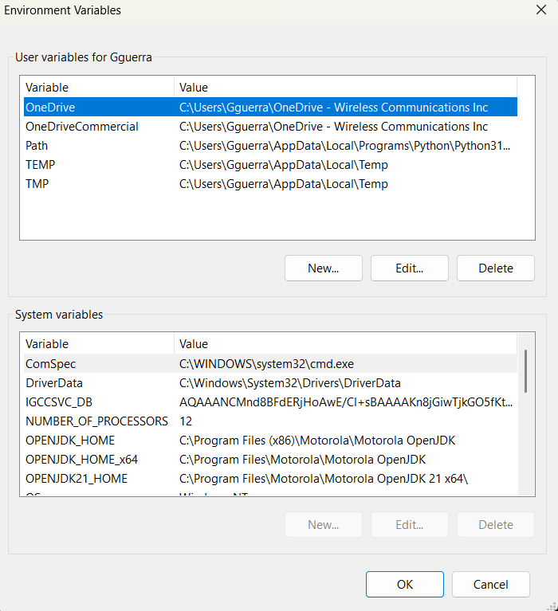
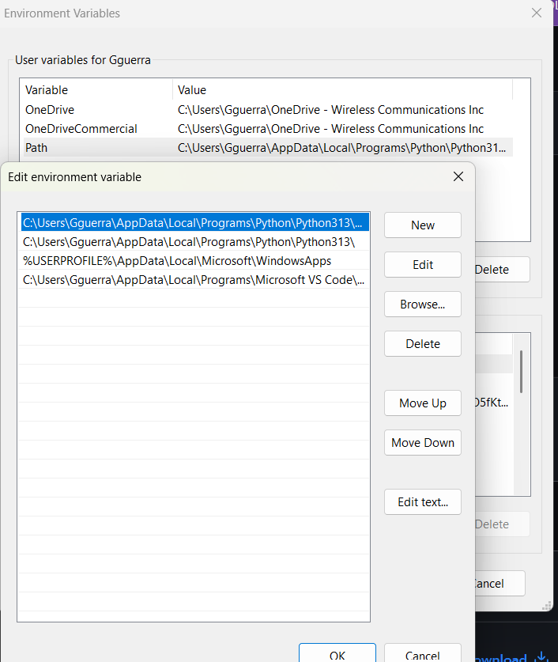
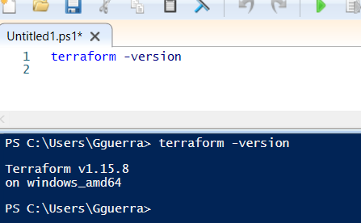
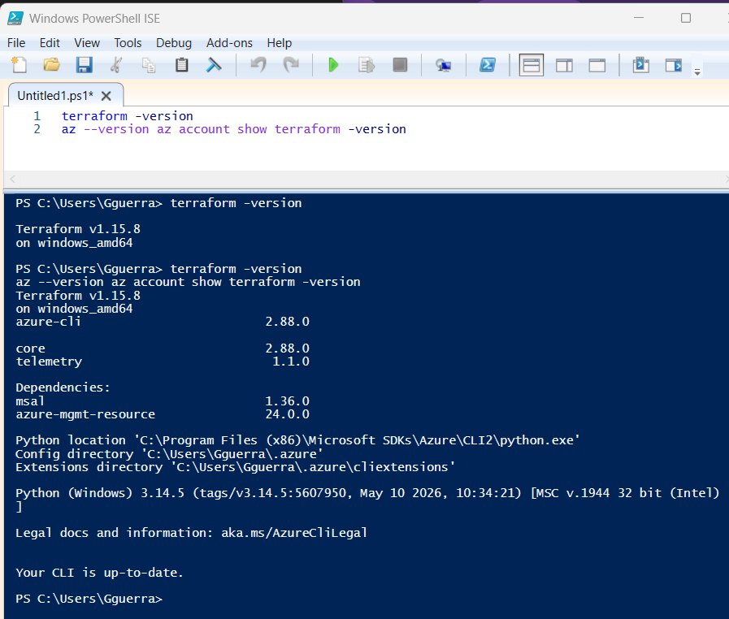
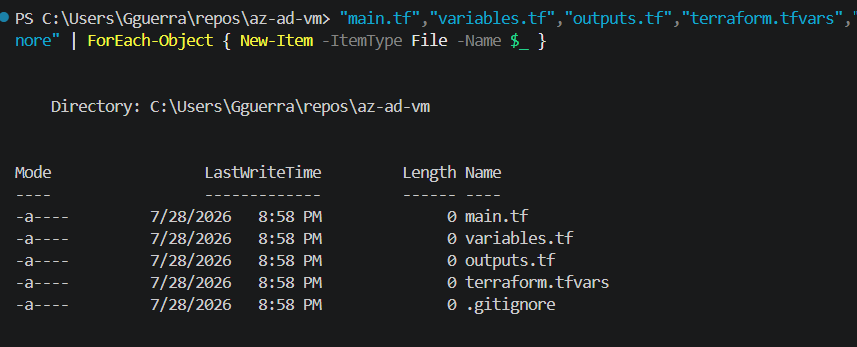
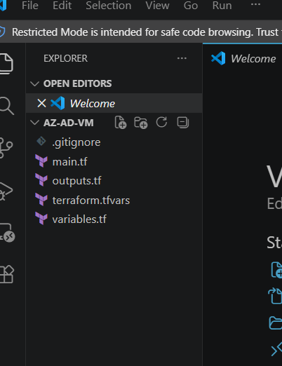
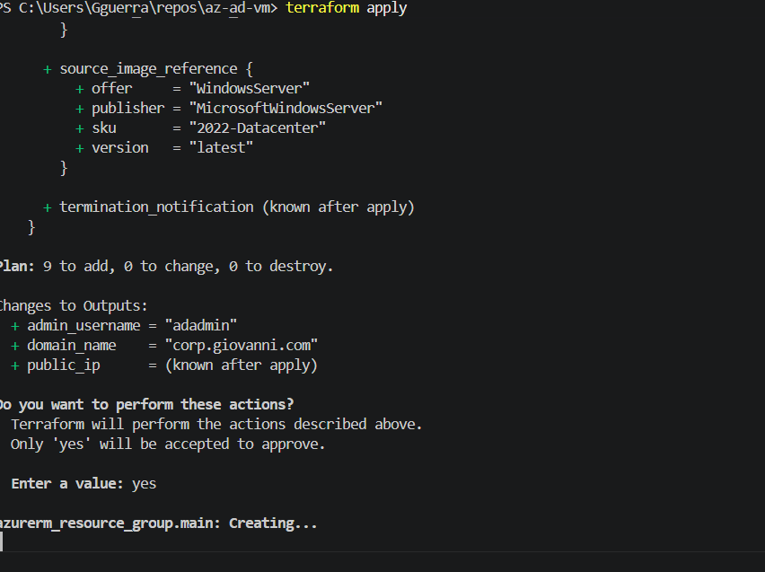

# Using Terraform to Deploy an Azure Active Directory Lab Environment

Windows Server 2022 | Azure | Terraform | Active Directory Domain Services

A Terraform lab that builds a fully functioning Active Directory domain controller in Azure from a handful of text files, no manual clicking through the Azure Portal required.

## What This Builds

A single `terraform apply` stands up:

- A resource group
- A virtual network and subnet
- A static public IP
- A network security group with an RDP rule scoped to one IP address
- A network interface and its security group association
- A Windows Server 2022 virtual machine
- A custom script extension that installs AD DS and promotes the VM to a new Active Directory forest



**9 resources total, in dependency order:**

```
resource_group
      │
      ├── virtual_network ── subnet
      ├── public_ip
      └── network_security_group
                │
                └── network_interface ── nsg_association
                            │
                            └── windows_virtual_machine
                                        │
                                        └── vm_extension (installs AD DS)


```


## Prerequisites

- [Azure CLI](https://aka.ms/installazurecliwindows) installed and signed in (`az login`)
- [Terraform](https://developer.hashicorp.com/terraform/downloads) v1.3 or newer
- An Azure subscription with permission to create resource groups and VMs

After installing Terraform, add its folder to your PATH via Environment Variables:





Confirm Terraform is picked up correctly:



Verify everything is ready:

```powershell
az --version
az account show
terraform -version
```



## Project Structure

```
az-ad-vm/
├── main.tf                 # Resource definitions
├── variables.tf             # Input variable declarations
├── terraform.tfvars         # Your personal values (never committed, see .gitignore)
├── outputs.tf                # Values printed after apply
├── .gitignore                 # Keeps secrets and state out of version control
└── .terraform.lock.hcl   # Provider version lock file
```

## Setup

**1. Create the project folder:**

```powershell
mkdir C:\repos\az-ad-vm
cd C:\repos\az-ad-vm
New-Item -ItemType File -Name main.tf, variables.tf, outputs.tf, terraform.tfvars, .gitignore
```



Open the folder in VS Code (**File → Open Folder**) and all five files show up ready to edit:



**2. Fill in `main.tf`** with the resource definitions (resource group, VNet, subnet, public IP, NSG, NIC, VM, and the AD DS install extension). Two things worth calling out in this file:

- `source_address_prefix = var.rdp_source` on the NSG rule, not a wildcard `"*"`, so RDP is only open to one IP
- The AD DS install script lives in `protected_settings`, not `settings`, so the DSRM password inside it is encrypted rather than sitting in plain text on the VM

**3. Fill in `variables.tf`** with the input declarations. `rdp_source` has no default on purpose, Terraform refuses to build anything until you supply your own IP.

**4. Fill in `terraform.tfvars`** with your real values:

```hcl
yourname        = "giovanni"
location        = "eastus"
admin_password  = "YourPassword123!"
dsrm_password   = "YourDSRMPassword123!"
domain_name     = "corp.giovanni.com"
domain_netbios  = "CORP"
rdp_source      = "YOUR_PUBLIC_IP/32"
```

Find your public IP with:

```powershell
(Invoke-WebRequest -Uri "https://api.ipify.org").Content
```

**5. Fill in `.gitignore`** before your first commit:

```
terraform.tfvars
.terraform/
*.tfstate
*.tfstate.backup
```

This is the single most common beginner mistake with Terraform: committing `terraform.tfvars` with real passwords in it to a public repository. Do this before your very first `git push`, not after.

## Build It

```powershell
terraform init
terraform plan
terraform apply
```

- `terraform init` downloads the `azurerm` provider. Run once per folder.
- `terraform plan` previews the 9 resources without building anything.
- `terraform apply` builds it for real, after you type `yes` to confirm.

**Expect roughly 10 minutes total:** about 5 to 8 minutes for the VM and networking, then another 3 to 5 minutes for the AD DS install script to run and the server to reboot.



## Connect to the Server

```powershell
terraform output public_ip
```

Open Remote Desktop Connection and connect to that IP. Try these credential formats in order:

| Method | Username | When to use it |
|---|---|---|
| Domain prefix | `CORP\adadmin` | Try this one first |
| UPN format | `adadmin@corp.giovanni.com` | If the first one does not work |
| Local account | `.\adadmin` | Only if the domain setup failed |

Wait 5 to 10 minutes after `apply` finishes before connecting. AD DS installation reboots the server on its own, and connecting too early just shows a black screen.

## Verify the Domain Controller

Once connected, open PowerShell as Administrator and run these **one at a time**, not pasted together as a single block:

```powershell
Get-Service NTDS | Select-Object Name, Status
```
```powershell
Get-ADDomain
```
```powershell
Get-ADDomainController -Filter *
```
```powershell
Resolve-DnsName corp.giovanni.com
```

If all four return without red error text, the domain controller is alive and working.

## Field Notes: Real Issues From My Own Build

The steps above are the clean, working path. Here is what actually happened during my own build of this lab, and how each issue got resolved, in the order I hit them.

| Problem | Cause | Fix |
|---|---|---|
| `main.tf` was empty when it came time to run `terraform plan` | The config text had been pasted into the editor tab but never saved with `Ctrl+S` before the file was checked | Reopen `main.tf`, paste the configuration back in, save immediately, and confirm the line count with `Get-Content main.tf \| Measure-Object -Line` |
| `terraform plan` returned instantly with no output at all | The command was run in Windows PowerShell ISE instead of VS Code's integrated terminal. ISE does not reliably display Terraform's console output | Run all Terraform commands from VS Code's own terminal (`` Ctrl+` ``), not a separate ISE window |
| `terraform validate` failed with `Missing required provider` | `terraform init` had not been run yet in this folder, so the `azurerm` provider plugin was never downloaded | Run `terraform init` once, then run `terraform validate` again |
| `terraform plan` hung for over 30 seconds with no output | The `azurerm` provider was waiting on Azure's automatic resource provider registration check, which stalled on `Microsoft.DataMigration` | Add `skip_provider_registration = true` inside the `provider "azurerm"` block in `main.tf`. This is the v3 provider syntax; v4 uses `resource_provider_registrations = "none"` instead |
| `Error acquiring the state lock` | An earlier interrupted Terraform run left two orphaned `terraform-provider-azurerm` processes running in the background, which kept the state file locked | Find the orphaned processes with `Get-Process \| Where-Object { $_.ProcessName -like "*terraform*" }`, then stop them with `Stop-Process -Force`. Stopping the process released the lock automatically |
| The plan showed `source_address_prefix = "YOUR_PUBLIC_IP/32"` | The `rdp_source` placeholder in `terraform.tfvars` was never replaced with a real IP address | Look up the real public IP with `(Invoke-WebRequest -Uri "https://api.ipify.org").Content` and update `rdp_source` before applying |
| The four verification commands failed with a `Select-Object` parameter error | All four commands were pasted in as one single line, so PowerShell tried to hand `Get-ADDomain` to `Select-Object` as an argument | Run each command on its own line, one at a time, instead of pasting them together |

**Takeaways:**

- A file that looks saved in an editor tab is not the same as a file saved to disk. Confirm with a line or word count before trusting a paste actually landed.
- PowerShell ISE and VS Code's terminal are two different programs. ISE can swallow the colored output Terraform depends on to show results, which looks exactly like a frozen command.
- A stuck `terraform plan` is often Azure, not Terraform. Provider registration checks and orphaned background processes both cause the exact same symptom.
- None of these were show stopping problems. Every one had a plain command line fix, and the lab still finished with a working domain controller.

## Clean Up

Azure keeps billing for the VM until it's torn down:

```powershell
terraform destroy
```

This deletes the resource group and everything inside it: the VM, its disk, the NIC, the public IP, the NSG, and the virtual network. Expect a few minutes, not seconds.

## What This Lab Skips for the Sake of Learning

| Lab shortcut | Production grade version |
|---|---|
| Passwords typed into `terraform.tfvars` | Passwords stored in Key Vault, pulled in automatically |
| State saved only on the local machine | Remote state in shared cloud storage so a team works from one source of truth |
| RDP open directly to one IP | A Bastion host, so the VM never has a public IP to attack |
| One domain controller | At least two, in different locations, for redundancy |
| `terraform apply` run manually | A CI/CD pipeline (e.g. GitHub Actions) runs it, with reviews and checks built in |

## Reference: Key Terraform Concepts Used Here

| Concept | Why it's there |
|---|---|
| `jsonencode({...})` | Converts the extension's settings into the JSON format Azure requires |
| `sensitive = true` | Hides a value from Terraform's console output and logs. It's a privacy screen, not encryption, which is why the DSRM password also needs `protected_settings` |
| Resource references (`azurerm_subnet.main.id`, etc.) | When one resource's config references another resource's ID, Terraform automatically infers build order |
| `tags = map(string)` | Applies a consistent label set to every resource at once |
